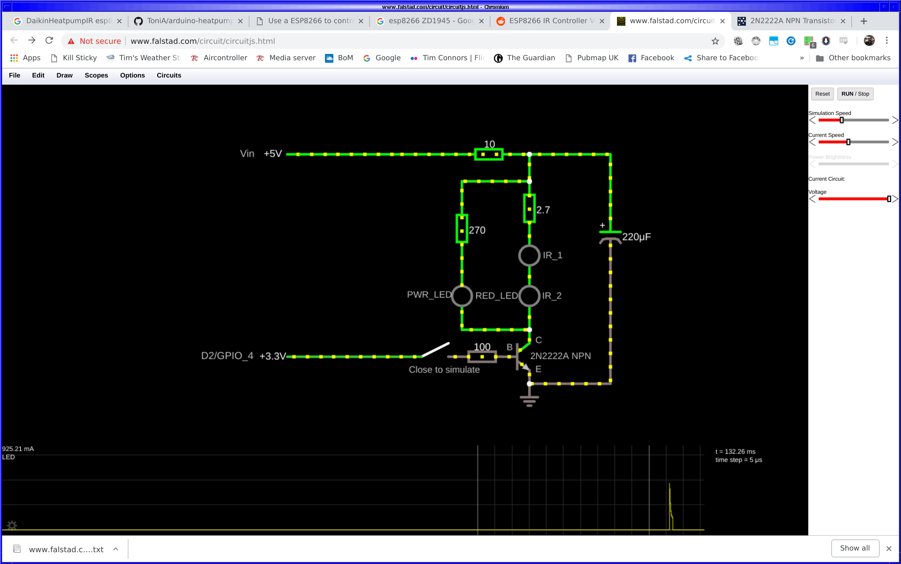

# esp8266-mitsubishi-heavy-ac-controller
Air conditioner wifi controller, using Arduino HeatpumpIR library,
currently for Mitsubishi Heavy AC, tested mimicking Rla502a700l
remote.

Since it uses the Arduino HeatpumpIR library, it should be trivial to
change to other AC remote control types (original version that didn't
make it into this git repo was using DaikinHeatpumpIR.h, and all of
the calls to heatpump.send simply didn't supply the last three
parameters).

## Install

Compile on the commandline with
https://github.com/plerup/makeEspArduino.git Currently works only up
until commit fb748959db7b69f9353b6c052d0471d730cd6830 (HEAD, tag:
5.4.3), because of bug
https://github.com/plerup/makeEspArduino/issues/155

Ensure the arduino GUI has downloaded HeatpumpIR library.

Download https://github.com/spacelama/template and copy
template/Makefile.customise-and-move-to-Makefile to template/Makefile,
customising the first 8 or so configuration parameters.

First time around, you probably don't have an OTA-ready image flashed
on your esp8266 board - so set `.DEFAULT_GOAL := flash` in Makefile.
After the first successful flash, you'll probably find it more
convenient to set that back to `.DEFAULT_GOAL := ota`.

Run `make`

## Hardware

Circuit diagram for infrared emitter:

I laid it out with these IO from the esp8266 board:

And onto breadboard first:

before transferring it onto a [prototype board for the wifi mini](https://www.jaycar.com.au/prototyping-shield-for-wifi-mini/p/XC3850):

## Usage

Navigate to your wifi controller's IP address, perhaps piping it to a
password protected reverse-proxy on your house's publicly accessible
web server (I know there's no input sanitising on any of the user
parameters, which is why it's password protected and only handed to
trusted individuals, right?)

Modifying any of the settings takes effect immediately.  Changing to
heat or cool automatically sets the temperature to 18 or 27
respectively.  Setting the temperature lower in cooling mode
automatically ramps up the fan (after all, you're clearly signalling
you're too hot), but then after that, the fan parameters can be
further modified.

You can interact with multiple interfaces at once (your phone, your
desktop, your partners phone).  Immediately after a change, it will
poll more often, but then reduce frequency down to checking once per
minute.  It only sends data to the AC (like all remote controls), and
doesn't read data if you happen to use the real remote, so it will
fall out of sync with phone the real remote updates the AC with in
this case.  But otherwise, it will correctly reflect the state of any
changes made with the API or the interface.

It grabs the current temperature from the "TLR" ("Temperature
Loungeroom") field of a JSON file which you will want to customise in
ajaxy.js:"oRequest.open('GET',
'https://rather.puzzling.org/weewx/data.json');".  The background
colour changes according to the mode the AC is in - red for heater,
blue for cooler, green for fan, grey for off (and dark grey for stale
data).  It compares the current temperature vs the setpoint
temperature in heating or cooling mode, and blends the colour with
"green" if the temperature is cooler (in cooling mode, or hotter in
heating mode) than the setpoint, thus
indicating the AC is only acting as a fan.

## API

You can GET/POST to "/off", "/ac_on", "/heater_on", "/fan_on".  You
can set parameters "power", "mode", "temp", "vdir", "hdir", "fan",
"silent", "3d" on any of actions or "/" (sends back the whole page) or
"/do" (just an ajax action).

You can read current paramters with GET "/get".
